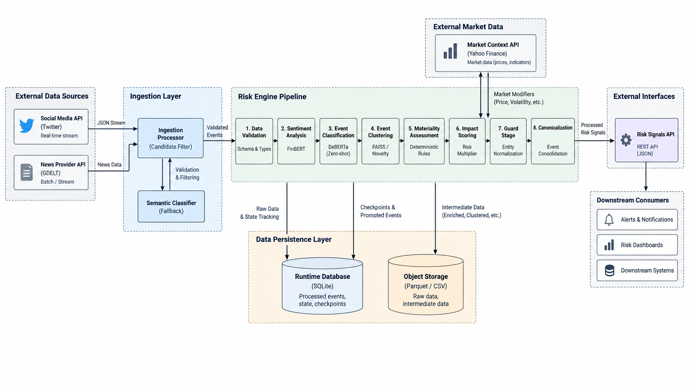

# RiskPulse - S&P Global & Crisil Campus Hackathon

**Candidate Name:** Ayush Dhoble
**College Email ID:** bt23cse204@iiitn.ac.in
**College / Campus:** Indian Institute of Information Technology, Nagpur
**Demo Video Link:** 
**Slide Deck Link:**
 
## 1. Project Overview / Problem Statement & Approach
Modern financial markets move at the speed of information, but the sheer volume of unstructured data from social feeds (like Twitter) and global news networks (like GDELT) creates immense noise. Analysts and risk managers struggle to differentiate between genuine material financial events and false alarms or duplicates, leading to alert fatigue and delayed decision-making. 

RiskPulse solves this by providing a unified AI-driven NLP Risk Engine. It ingests unstructured text streams and processes them through a multi-stage pipeline designed to filter out the noise. By combining large language models for sentiment and event classification with deterministic rules for materiality and real-world market context, the system autonomously surfaces canonical, high-impact risk signals. 

Our approach ensures high recall at the ingestion stage and systematically funnels down to high-precision alerts. We cluster events to handle duplication and measure novelty, and actively query market data (e.g., Yahoo Finance) to verify if an identified risk event is genuinely impacting asset prices, ensuring the final output is highly actionable.

## 2. Datasets & Data Sources
RiskPulse relies on three primary data sources to capture, enrich, and validate risk signals:

- **Twitter Data (Historical & Simulated):** We use historical financial tweets to simulate rapid, high-volume social media chatter. Twitter data often contains early warnings of market-moving events but is highly noisy. We use this dataset to stress-test our NLP pipeline's ability to filter out spam and correctly identify sentiment.
- **GDELT (Global Database of Events, Language, and Tone):** GDELT serves as our live news ingestion engine. It provides a massive, real-time stream of global news articles. RiskPulse queries GDELT to capture broader geopolitical, macroeconomic, and corporate news, converting these unstructured articles into structured risk observations.
- **Yahoo Finance (`yfinance`):** Real-world market context is crucial. Once an event is identified, we query `yfinance` to fetch live or historical market data for the affected entity. This allows us to see if the stock price or trading volume is actively reacting to the news, acting as a reality check to amplify or dampen the event's impact score.

## 3. Architecture & Data Pipeline
The RiskPulse architecture operates on a robust, multi-stage pipeline that transitions data from raw ingestion to actionable insights on a dashboard. 



### The Overall Data Pipeline
Our pipeline executes in a strict, sequential funnel to turn noise into intelligence:

1. **Data Ingestion:** Unstructured text from GDELT or Analyst Simulations (Twitter data) enters the pipeline as raw observations.
2. **Entity Resolution:** The text is scanned to identify and normalize the core entity (e.g., mapping "Apple Inc." or "AAPL" to a canonical `Apple` entity).
3. **Sentiment Analysis:** We run the text through **FinBERT** to extract financial sentiment (positive, negative, neutral) and a normalized sentiment score.
4. **Zero-Shot Event Classification:** Using **DeBERTa-v3**, we first classify if the text is a genuine financial event (Relevance). If relevant, we classify the specific event type (e.g., *Credit Event, Geopolitical, Merger & Acquisition*).
5. **Materiality & Impact Scoring:** A baseline impact score is calculated based on the event type, entity prominence, and sentiment severity. 
6. **Semantic Clustering (FAISS):** The text is embedded using **SentenceTransformers** (`bge-small-en-v1.5`) and clustered using **FAISS**. This deduplicates repeating news stories into "Canonical Events" and calculates a *Novelty Score* (breaking news gets a high score, whereas the 50th article on the same topic gets a low score).
7. **Market Context Validation:** The system queries `yfinance` to fetch the entity's recent market performance. If the market is ignoring the "breaking news", the impact score is dampened. If the market is reacting violently, the score is amplified.
8. **Portfolio Stress Engine:** The finalized Canonical Risk Signals are applied against a synthetic portfolio to calculate potential exposure and theoretical P&L impacts.
9. **Command Center Dashboard:** The results are explicitly promoted to the React frontend, where analysts can view the portfolio overview, investigate event provenance, and compare stress scenarios.

### Tech Stack
- **Backend & Data Processing:** Python 3, Pandas, NumPy.
- **AI / Machine Learning:** PyTorch, Hugging Face Transformers (FinBERT, DeBERTa-v3), FAISS, SentenceTransformers.
- **External Integrations:** Yahoo Finance API (`yfinance`), GDELT APIs.
- **API & Persistence:** FastAPI for backend services, SQLite (WAL mode) for tracking pipeline checkpoints and promoted events.
- **Frontend / UI:** React 19, TypeScript, Vite, Tailwind CSS, Framer Motion, and Lucide React.
 
## 4. Quickstart & Installation
Runtime: Python 3.11+ / Node.js 20+ on Windows / Linux / macOS.
 
Step-by-step commands to set up the environment and run the code locally:

```bash
# 1. Clone the repository
git clone https://github.com/Ayush-D2004/IIITN-AyushDhoble-Hackathon.git
cd IIITN-AyushDhoble-Hackathon

# 2. Setup the Python Virtual Environment & Install Dependencies
python -m venv .venv
# On Windows: .venv\Scripts\activate
# On Mac/Linux: source .venv/bin/activate
pip install -r requirements.txt
pip install faiss-cpu sentence-transformers  # Required for the clustering engine

# 3. Terminal 1: Start the FastAPI Backend
uvicorn src.dashboard.api:app --host 0.0.0.0 --port 8000 --reload

# 4. Terminal 2: Start the React Frontend
cd frontend
npm install
npm run dev

# 5. Terminal 3 (Optional): Run the Pipeline manually on a dataset
python src/pipeline/run_pipeline.py --input <path_to_input.csv> --output-dir <path_to_output_dir>
```
 
## 5. Key Results & Domain Impact
- **What it demonstrates:** RiskPulse successfully distills thousands of noisy data points into a handful of deduplicated, impact-scored, and market-verified Risk Signals. The dashboard visualizes these signals, clearly separating non-material noise from critical financial events.
- **Business Impact:** For institutional investors, risk managers, and analysts, this system drastically reduces time-to-insight. By automating the triage of breaking news and social media chatter, financial professionals can react to market-moving events faster and with greater confidence, minimizing exposure to unforeseen risks and maximizing opportunities.
